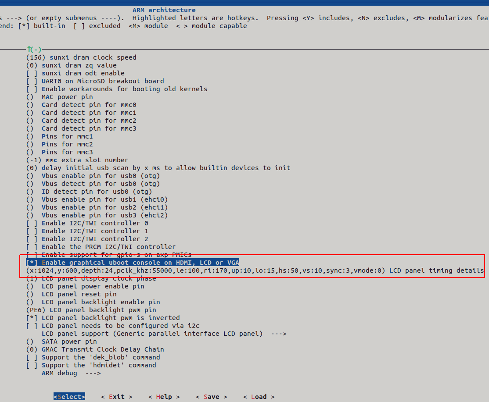
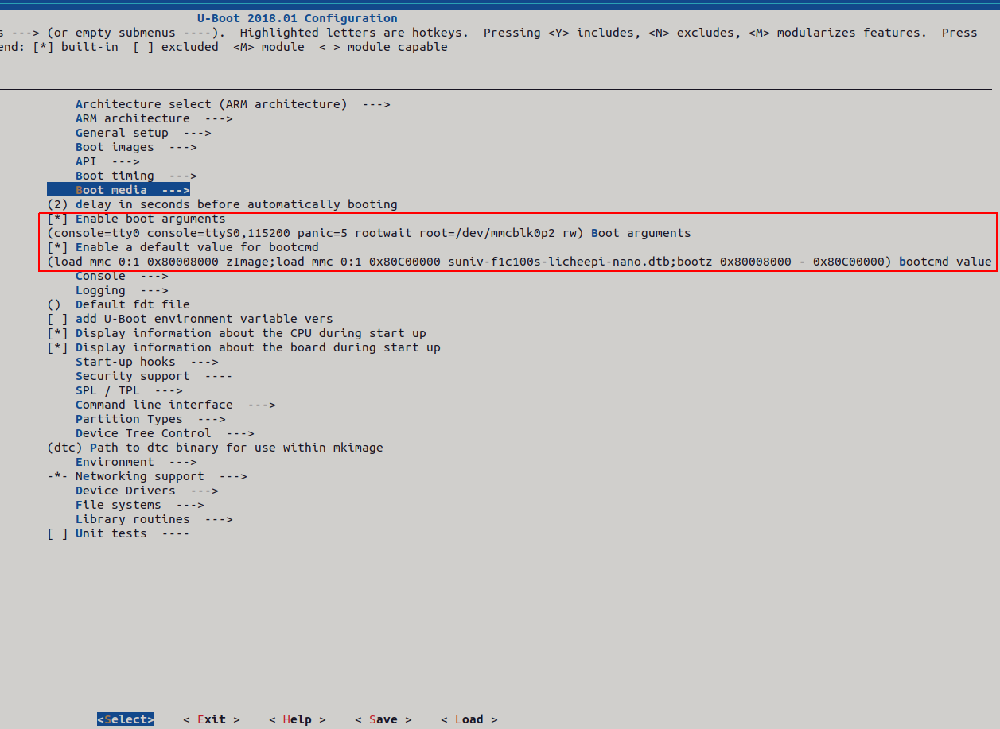

<h1>
Uboot for F1C100S Processer from Allwinner
</h1>

Visit https://ohmbedkernel.substack.com/ to read more articles about F1C100S

<h2>
1. Install the necessary library packages
</h2>

```bash
sudo apt-get install gcc make cmake rsync wget unzip build-essential git bc swig libncurses-dev libpython3-dev libssl-dev python3-distutils android-tools-mkbootimg -y
```

<h2>
2. Download Uboot source
</h2>

```bash
git clone https://github.com/QuangPhuoc1998/250420-F1C100S-UBoot.git
cd 250420-F1C100S-UBoot
```

<h2>
3. Config buildroot
</h2>

<h4>
Export the path first
</h4>

```bash
export ARCH=arm
export CROSS_COMPILE=arm-buildroot-linux-gnueabi-
export PATH=$PATH:~/250420-F1C100S-Builroot-2022.02/output/host/bin/
```

```bash
unzip F1C100S-UBoot
cd F1C100S-UBoot
make licheepi_nano_defconfig
make menuconfig
#Configure ARM architecture -> Enable graphical uboot console on HDMI, LCD or VGA Enter LCD parameters 1024*600 in the brackets below as Y Screen parameters: 
Select "ARM architecture:
-> Enable graphical uboot console on HDMI, LCD or VGA
Input parameters "x:1024,y:600,depth:24,pclk_khz:55000,le:100,ri:170,up:10,lo:15,hs:50,vs:10,sync:3,vmode:0"
```



```bash
# Setting bootcmd
Configure Enable boot arguments to be Y
Input parameters: console=ttyS0,115200 panic=5 rootwait root=/dev/mmcblk0p2 earlyprintk rw
Configure Enable a default value for bootcmd to be Y
Input parameters: load mmc 0:1 0x80008000 zImage;load mmc 0:1 0x80c08000 suniv-f1c100s-licheepi-nano.dtb;bootz 0x80008000 - 0x80c08000;
Then:
Save and eixt
```



<h2>
4. Compile UBoot
</h2>

```bash
make menuconfig
```

<h4>
If you get the error about missing python package, run:
</h4>

```bash
sudo apt install python3
sudo apt-get install python-dev
```
<h2>
5. Output
</h2>

<h4>
After compile completed, you will have the bootloader file for F1C100S:<br>
File: u-boot-sunxi-with-spl.bin
</h4>